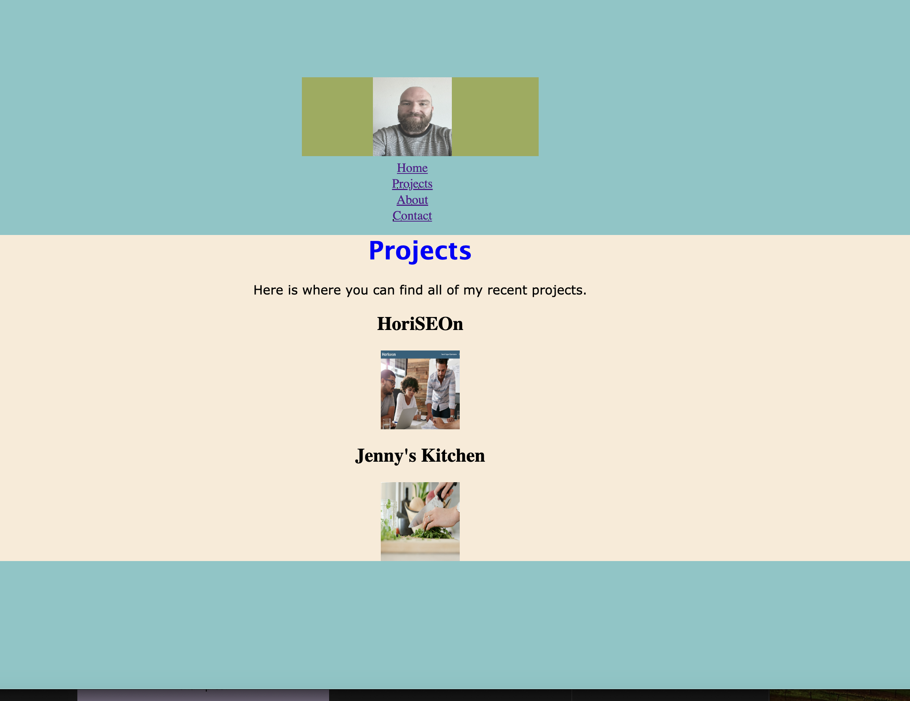

# johndennisportfolio
This is my portfoilo site where you can find my info and projects.
I used code from myself and W3schools.

I also took screen shots.

as you can see on screenshot2 I was able to get the clickable images to align locally but as many times as i tried to push changes it never worked.

the code appears the exact same...

